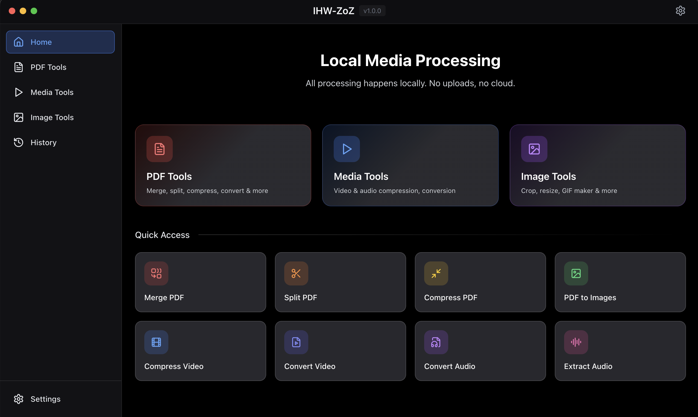

<p align="center">
  
</p>

<h1 align="center">IHW-ZoZ</h1>

<p align="center">
  <strong>Cross-platform Local Media Processing Tool</strong><br>
  Works completely offline - your files never leave your computer
</p>

<p align="center">
  
  
  
  
  
</p>

<p align="center">
  <a href="#-features">Features</a> •
  <a href="#-installation">Installation</a> •
  <a href="#-tech-stack">Tech Stack</a> •
  <a href="#-license">License</a> •
  <a href="README.zh-TW.md">繁體中文</a> •
  <a href="README.ja.md">日本語</a>
</p>

---

<p align="center">
  
</p>

---

## Features

<table>
<tr>
<td width="33%" valign="top">

### PDF Tools

| Feature | Description |
|:-----|:-----|
| Merge | Combine multiple PDFs |
| Split | Split into multiple files |
| Compress | Reduce file size |
| To Image | Convert pages to images |
| Rotate | Rotate page orientation |
| Watermark | Add text watermark |
| Encrypt/Decrypt | Password protection |

</td>
<td width="33%" valign="top">

### Media Tools

| Feature | Description |
|:-----|:-----|
| Video Compress | Reduce video size |
| Video Convert | MP4/MKV/AVI... |
| Audio Convert | MP3/WAV/FLAC... |
| Audio Extract | Extract audio from video |
| Media Trim | Extract specific segments |

</td>
<td width="33%" valign="top">

### Image Tools

| Feature | Description |
|:-----|:-----|
| GIF Maker | Create GIF from images |
| Resize | Adjust image dimensions |
| Crop | Crop specific areas |
| Rotate | Rotate any angle |
| Flip | Horizontal/Vertical flip |
| Upscale | AI lossless upscaling |

</td>
</tr>
</table>

---

## Privacy Protection

```
┌─────────────────────────────────────────────────────────┐
│                                                         │
│   All processing is done locally on your computer       │
│                                                         │
│   ✓ No internet required      ✓ No cloud uploads        │
│   ✓ No tracking               ✓ Fully open source       │
│                                                         │
└─────────────────────────────────────────────────────────┘
```

---

## System Requirements

| Item | Requirement |
|:-----|:-----|
| Operating System | Windows 10+, macOS 10.15+, Linux |
| Node.js | 18.0 or higher |
| Python | 3.9 or higher |

---

## Installation

### Quick Start

```bash
# 1. Clone the repository
git clone https://github.com/maplex18/IHW-ZoZ.git
cd IHW-ZoZ

# 2. Install Node.js dependencies
npm install

# 3. Install Python dependencies
pip install -r python/requirements.txt

# 4. Start development mode
npm run dev
```

### Build Application

<table>
<tr>
<td>

**Windows**
```bash
npm run build:win
```

</td>
<td>

**macOS**
```bash
npm run build:mac
```

</td>
<td>

**Linux**
```bash
npm run build:linux
```

</td>
</tr>
</table>

---

## Tech Stack

```
IHW-ZoZ
├── Frontend (Renderer)
│   ├── ⚛️  React 18
│   ├── 📘 TypeScript
│   └── 🎨 Tailwind CSS
│
├── Desktop Framework
│   └── ⚡ Electron 33
│
└── Backend (Python)
    ├── 📄 PyPDF2 / pdf2image
    ├── 🎬 FFmpeg
    └── 🖼️  Pillow
```

---

## License

This project uses a **Custom License**. See [LICENSE](LICENSE) for details.

<table>
<tr>
<td>🚫</td>
<td><strong>No Illegal Use</strong></td>
<td>Must not be used for any illegal purposes</td>
</tr>
<tr>
<td>🚫</td>
<td><strong>No Commercial Use</strong></td>
<td>Cannot be used for commercial purposes without authorization</td>
</tr>
<tr>
<td>✅</td>
<td><strong>Attribution Required</strong></td>
<td>Must retain original author information when modifying or distributing</td>
</tr>
</table>

---

## Author

**maple**

---

## Disclaimer

> This software is provided for personal learning and legal use only. The author is not responsible for any loss or legal issues arising from the use of this software. Users must ensure their usage complies with local laws and regulations.

---

<p align="center">
  <sub>Built with ❤️ using Electron + React + Python</sub>
</p>
