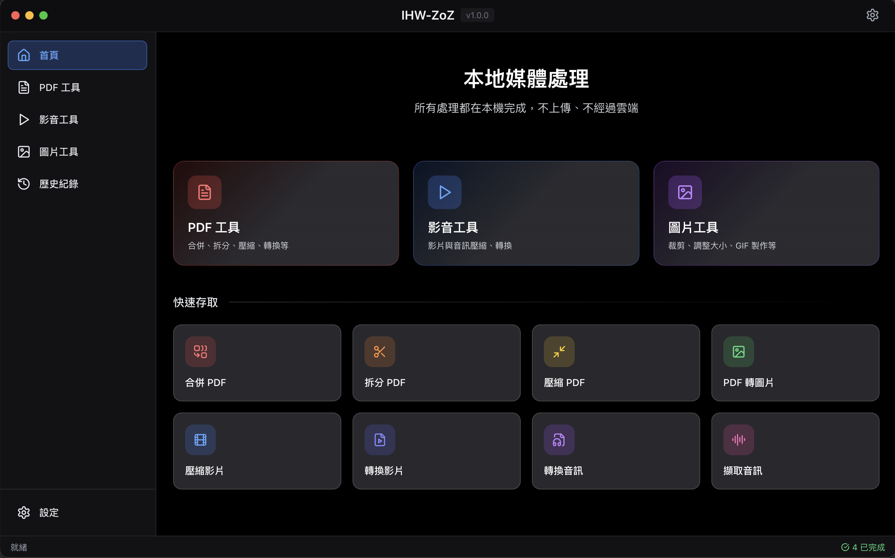

<p align="center">
  
</p>

<h1 align="center">IHW-ZoZ</h1>

<p align="center">
  <strong>跨平台本地媒體處理工具</strong><br>
  完全離線運作，您的檔案不會上傳至任何伺服器
</p>

<p align="center">
  
  
  
  
  
</p>

<p align="center">
  <a href="#-功能特色">功能特色</a> •
  <a href="#-安裝指南">安裝指南</a> •
  <a href="#-技術架構">技術架構</a> •
  <a href="#-授權條款">授權條款</a> •
  <a href="README.md">English</a> •
  <a href="README.ja.md">日本語</a>
</p>

---

<p align="center">
  
</p>

---

## 功能特色

<table>
<tr>
<td width="33%" valign="top">

### PDF 工具

| 功能 | 說明 |
|:-----|:-----|
| 合併 | 多個 PDF 合而為一 |
| 分割 | 拆分為多個檔案 |
| 壓縮 | 減少檔案大小 |
| 轉圖片 | 頁面轉換為圖片 |
| 旋轉 | 旋轉頁面方向 |
| 浮水印 | 添加文字浮水印 |
| 加解密 | 密碼保護功能 |

</td>
<td width="33%" valign="top">

### 媒體工具

| 功能 | 說明 |
|:-----|:-----|
| 影片壓縮 | 減少影片大小 |
| 影片轉檔 | MP4/MKV/AVI... |
| 音訊轉檔 | MP3/WAV/FLAC... |
| 音訊提取 | 從影片提取音軌 |
| 媒體裁剪 | 擷取特定片段 |

</td>
<td width="33%" valign="top">

### 圖片工具

| 功能 | 說明 |
|:-----|:-----|
| GIF 製作 | 多圖合成動圖 |
| 縮放 | 調整圖片尺寸 |
| 裁切 | 裁切指定區域 |
| 旋轉 | 任意角度旋轉 |
| 翻轉 | 水平/垂直翻轉 |
| 放大 | AI 無損放大 |

</td>
</tr>
</table>

---

## 隱私保護

```
┌─────────────────────────────────────────────────────────┐
│                                                         │
│   🔐 所有處理皆在本地完成，檔案不會離開您的電腦        │
│                                                         │
│   ✓ 無需網路連線        ✓ 無雲端上傳                   │
│   ✓ 無追蹤程式          ✓ 完全開源                     │
│                                                         │
└─────────────────────────────────────────────────────────┘
```

---

## 系統需求

| 項目 | 需求 |
|:-----|:-----|
| 作業系統 | Windows 10+、macOS 10.15+、Linux |
| Node.js | 18.0 或更高版本 |
| Python | 3.9 或更高版本 |

---

## 安裝指南

### 快速開始

```bash
# 1️⃣ 複製專案
git clone https://github.com/maplex18/IHW-ZoZ.git
cd IHW-ZoZ

# 2️⃣ 安裝 Node.js 依賴
npm install

# 3️⃣ 安裝 Python 依賴
pip install -r python/requirements.txt

# 4️⃣ 啟動開發模式
npm run dev
```

### 打包應用程式

<table>
<tr>
<td>

**Windows**
```bash
npm run build:win
```

</td>
<td>

**macOS**
```bash
npm run build:mac
```

</td>
<td>

**Linux**
```bash
npm run build:linux
```

</td>
</tr>
</table>

---

## 技術架構

```
IHW-ZoZ
├── 前端 (Renderer)
│   ├── ⚛️  React 18
│   ├── 📘 TypeScript
│   └── 🎨 Tailwind CSS
│
├── 桌面框架
│   └── ⚡ Electron 33
│
└── 後端 (Python)
    ├── 📄 PyPDF2 / pdf2image
    ├── 🎬 FFmpeg
    └── 🖼️  Pillow
```

---

## 授權條款

本專案採用 **自訂授權條款**，詳見 [LICENSE](LICENSE)

<table>
<tr>
<td>🚫</td>
<td><strong>禁止違法使用</strong></td>
<td>不得用於任何違法用途</td>
</tr>
<tr>
<td>🚫</td>
<td><strong>禁止商業使用</strong></td>
<td>未經授權不得用於商業目的</td>
</tr>
<tr>
<td>✅</td>
<td><strong>署名要求</strong></td>
<td>修改或散布時須保留原作者資訊</td>
</tr>
</table>

---

## 作者

**maple**

---

## 免責聲明

> 本軟體僅供個人學習與合法用途使用。作者不對任何因使用本軟體而導致的損失或法律問題負責。使用者須自行確保其使用方式符合當地法律法規。

---

<p align="center">
  <sub>Built with ❤️ using Electron + React + Python</sub>
</p>
